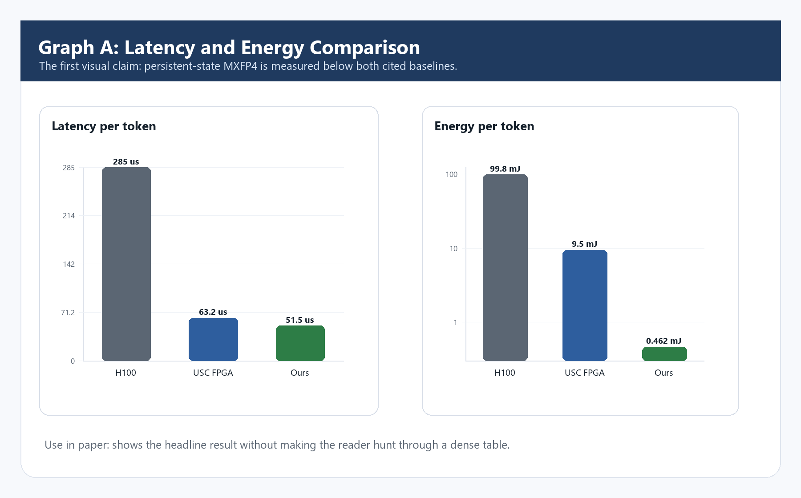
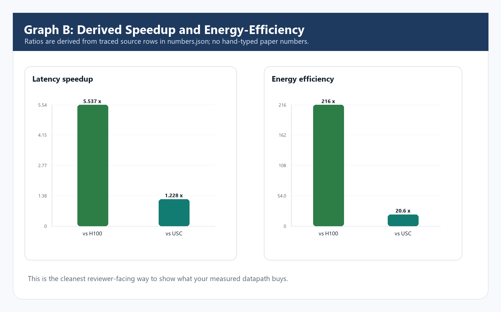
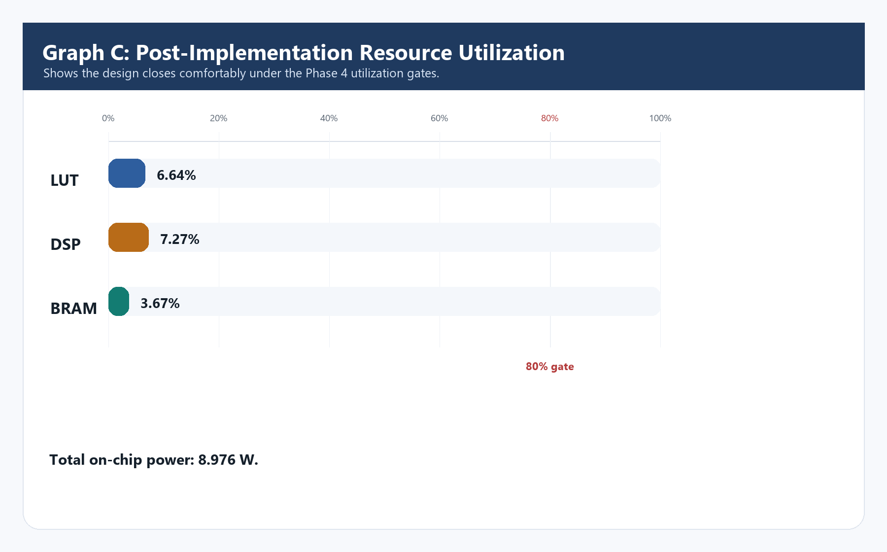
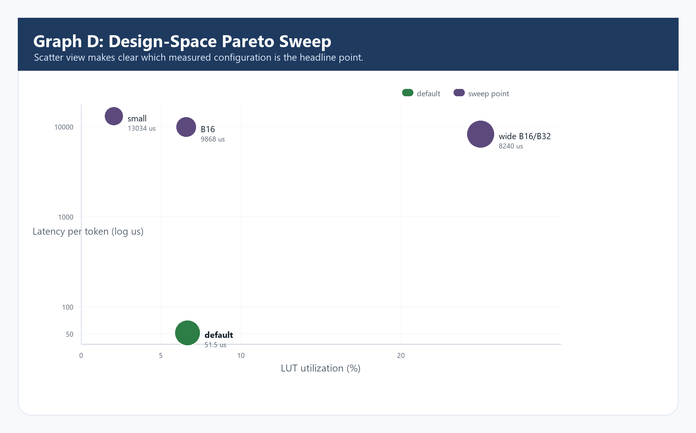
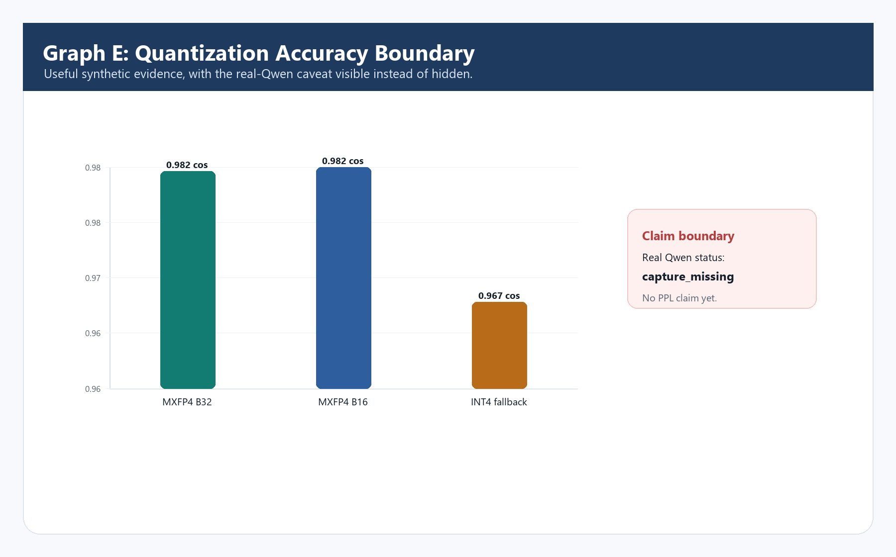

# Graph Preview Images

Generated from `paper/numbers.json` and `reports/benchmark/sweep.csv`.
These are visual drafts for deciding the paper story before LaTeX integration.

## Graph A Latency Energy

## Graph B Speedup Efficiency

## Graph C Resource Utilization

## Graph D Design Pareto

## Graph E Accuracy Boundary

