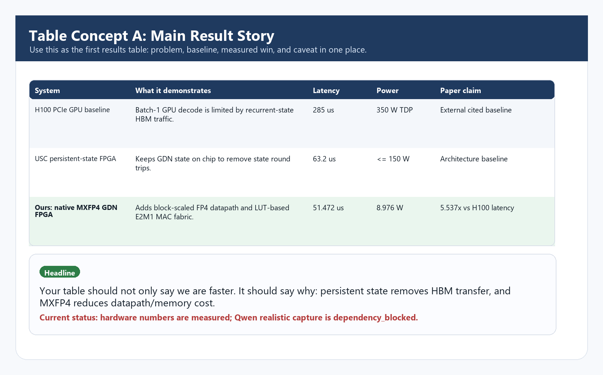
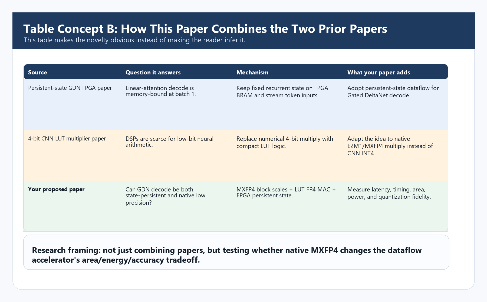
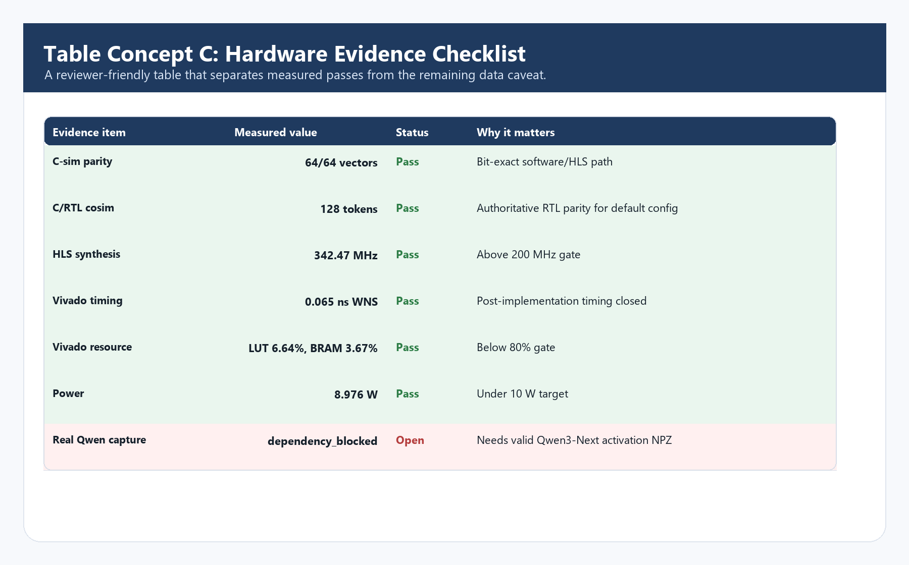
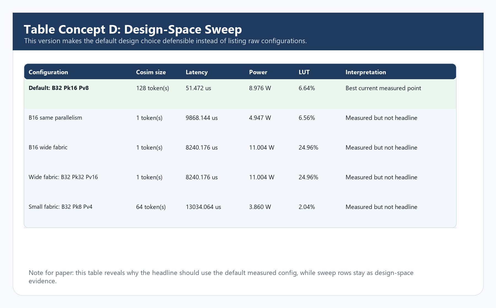
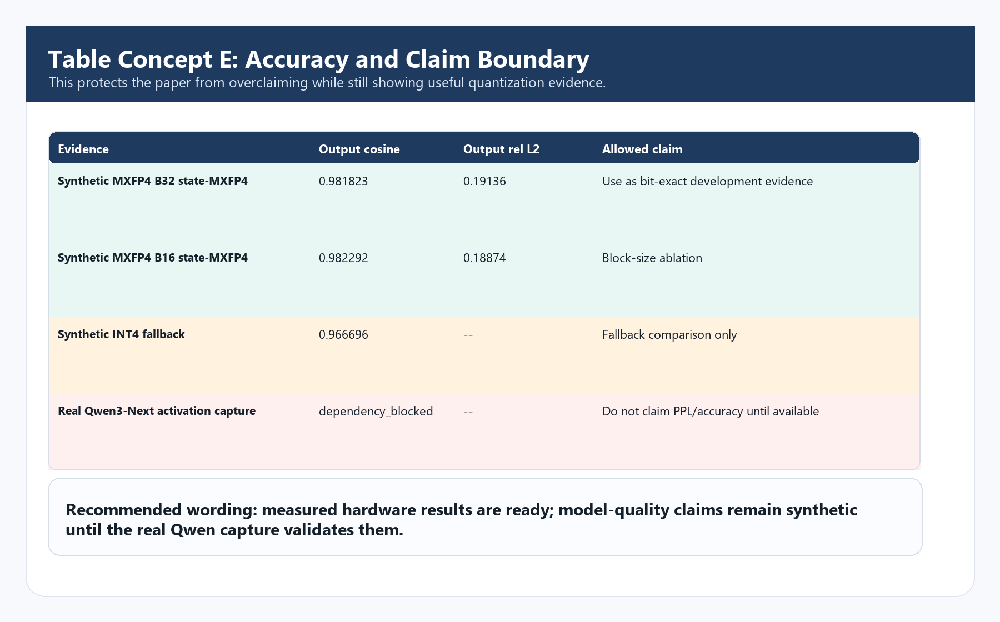

# Table Preview Images

Generated from `paper/numbers.json`, `reports/benchmark/sweep.csv`, and the two source-paper concepts.
These are visual drafts only; generated LaTeX tables are intentionally unchanged for now.

## Table A Main Result Story

## Table B Source Synthesis

## Table C Hardware Evidence

## Table D Design Sweep

## Table E Accuracy Boundary

